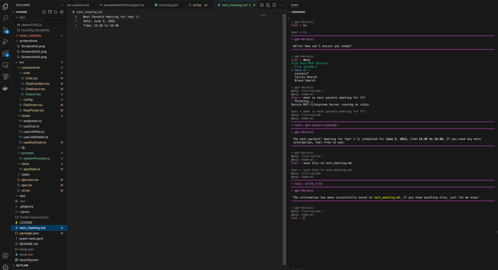
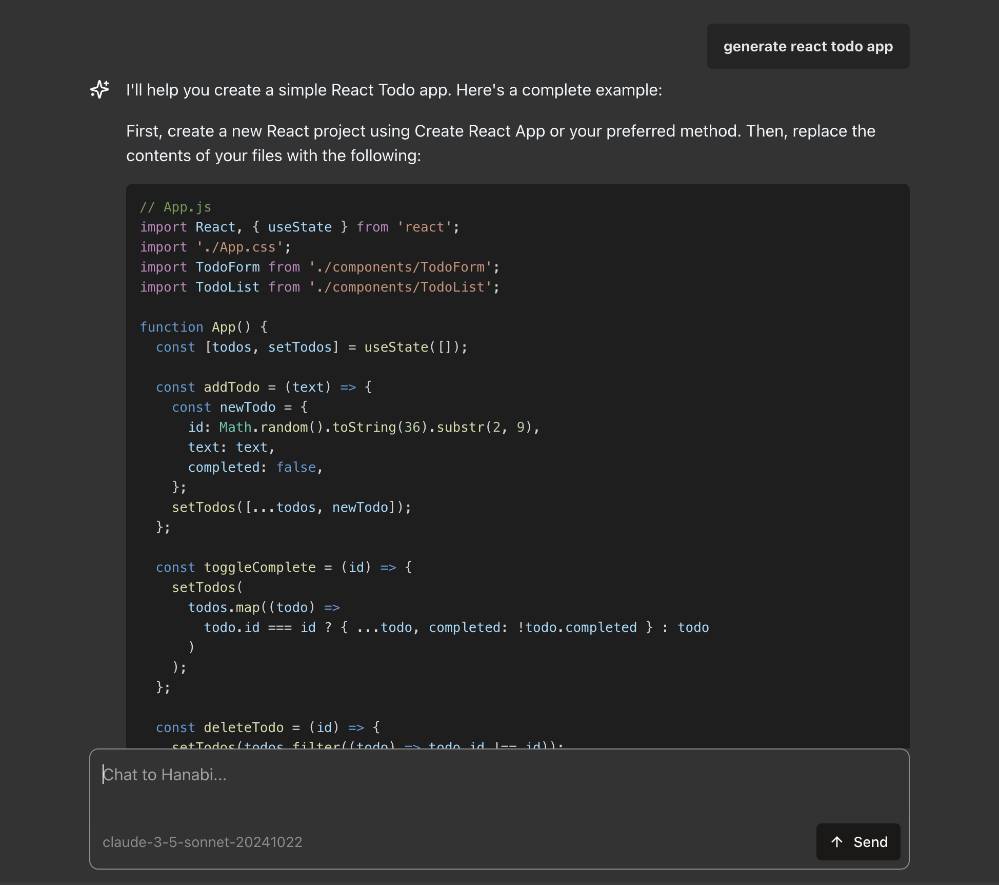

# hanabi-cli

> ⟡ A terminal AI chat interface for any LLM model, with file context, MCP and deployment support.

- Local multi skilled agent with files, clipboard & MCP support
- Project folder scoped - different agent per project
- Host your agent web chat UI (Next.js) from command line in seconds and ready for deployment
- Create a multi-agent cluster with predefind [strategies](#multi-agents-system).
- Checkout [Hanabi Config File](/types/HanabiConfig.d.ts) for full list of features.

## Command line interface



## Web Chat UI



## Table of Contents

- [Install](#install)
- [CLI](#cli)
- [MCP Servers](#mcp-servers)
- [Exclude files](#exclude-files)
- [Local envs](#local-envs)
- [Custom System Prompt](#custom-system-prompt)
- [Local config file override](#local-config-file-override)
- [Streaming Mode](#streaming-mode)
- [Answer Schema (Deterministic Output Format)](#answer-schema)
- [Web Chat UI Server (with APIs)](#web-chat-ui-server)
- [Advanced - Multi Agents System](#multi-agents-system)
- [TODOs](#todos)

## Install

```bash
$ npm install -g hanabi-cli
```

## CLI

Get Help

```
$ hanabi --help
```

Start hanabi chat session

```
$ hanabi
```

Reset config file

```
$ hanabi reset
```

Ask single question and print result. (Yes Hanabi auto injects today's date and timezone for you as context)

```
$ hanabi ask "how's the weather tomorrow?"
$ hanabi ask "generate a react todo app" > ./todo-app-instructions.md
```

## MCP Servers

In your `<user home folder>/.hanabi.json`, add `mcpServers` config.

```
{
	"llms": [
		// ...
	],
	"defaultModel": {
		// ...
	},
	"mcpServers": {
		"home-ai": {
			"name": "Home AI",
			"transport": "stdio",
			"command": "node",
			"args": ["c:/folder/home-mcp.js"]
		},
		"context7": {
			"name": "context7",
			"transport": "stdio",
			"command": "npx",
			"args": ["-y", "@upstash/context7-mcp@latest"]
		},
		"browser-use": {
			"name": "Browser-use automation",
			"transport": "sse",
			"url": "http://172.17.0.1:3003/sse",
			"headers": {
				"authentication": "Bearer api-token"
			}
		},
		// npx stdio approach is flaky & slow. highly recommend
		// to npm install -g <mcp-server> and use the following.
		// see https://github.com/modelcontextprotocol/servers/issues/64
        // "file-system": {
        // 	"name": "file system",
        // 	"transport": "stdio",
        // 	"command": "path/to/your/node.exe",
        // 	"args": [
		// "path/to/global/node_modules/@modelcontextprotocol/server-filesystem/dist/index.js", "."]
        // },
		"tavily": {
			"name": "Tavily Search",
			"transport": "stdio",
			"command": "npx",
			"env": {
				"TAVILY_API_KEY": "your-api-key"
			},
			"args": ["-y", "tavily-mcp@0.1.4"]
		},
		// npx is slow! use above recommendation
		"file-system": {
			"name": "file system",
			"transport": "stdio",
			"command": "npx",
			"args": ["-y", "@modelcontextprotocol/server-filesystem", "."]
		},
		"my-calendar": {
			"name": "My Calendar",
			"transport": "streamable_http",
			"url": "http://172.17.0.1:3001/mcp",
			"headers": {
				"authentication": "Bearer my-auth-token"
			}
		}
	}
}
```

## Exclude files

To prevent files from being accessed, add [globby](https://github.com/sindresorhus/globby) patterns in the config

All files included in the .gitignore will also be auto excluded.

```
// <user home folder>/.hanabi.json
{
	"exclude": ["certificates", "screenshots/**/*", "passwords/*", "*.pid"],
	"llms": [
		// ...
	],
	"defaultModel": {
		// ...
	}
}
```

## Local Envs

Hanabi supports local dot env files (`.env`).
You can also add `envs` field to `.hanabi.json`.
use `file://` prefix URL to inject file content as env variable
Supports only plain text files e.g. `*.json`,`*.txt`, `*.html` etc.
To inject PDF file content into process.env, convert them to text files by using something like `pdf2json`.

add `ALLOWED_ORIGIN` env to add cors protection for the API server.

```
// .hanabi.json
{
	"envs": {
		"FOO": "bar",
		"MY_DOC: "file://./README.md",
		"ALLOWED_ORIGIN": "http://localhost:3042"
	},
	"llms": [
		// ...
	],
	"defaultModel": {
		// ...
	}
}
```

If you do not want to store provider api key or any other tokens in `.hanabi.json`, delete the `apiKey` fields and save them inside working directly `.env` instead. Key names are as below. see [Providers](https://ai-sdk.dev/providers/ai-sdk-providers) or [.env.example](./.env.example) for api key env names.

```
OPENAI_API_KEY=xxx
GOOGLE_GENERATIVE_AI_API_KEY=xxx
DEEPSEEK_API_KEY=xxx
ANTHROPIC_API_KEY=xxx
GROQ_API_KEY=xxx
XAI_API_KEY=xxx

# MCP keys
TAVILY_API_KEY=xxx
```

## Custom System Prompt

Hanabi comes with predefined simple system prompt to show docs on terminal commands and provide date & timezone context. You can provide extra system prompt in `hanabi.system.prompt.md` at working directory. Use `/gen` handle or `hanabi gen` to generate one for you.

Variables are supported via `${VAR_NAME}` syntax, they are read from process.env. see [Local envs](#local-envs).

example `hanabi.system.prompt.md`

```markdown
# act as a polite chat bot collecting user feedback via conversational loop.

## context

Product name is ${PRODUCT_NAME}

## ask user the follwing questions one by one and prints a well formatted report

- What is your name
- How do you feel about our product? (classify answer as "Bad" | "OK" | "great")
- What is your company
```

## Local config file override

You can copy `<user home folder>/.hanabi.json` to your working directly (e.g. project level) to override user level config. LLMs are merged by provider name. Use `/gen` or `hanabi gen` handle to generate one for you.

## Streaming mode

Toggle `"streaming":true` at `<user home folder>/.hanabi.json` or the one at working directory.

## Answer Schema

It's quite important for workflow agent to output answer in a deterministic schema, e.g when asking agent to generate API call payload. To achieve that, define `answerSchema` that's Zod schema compliant in the config file.

- `answerSchema` will be applied in
  - cli chat answers when @schema handle is active
  - cli single question mode `hanabi ask "list top 10 movies in 2023" > output.json`
  - Web UI chat with toggle
  - server APIs e.g. [`/api/generate`](/ui/README.md)
- Use `/gen` handle or `hanabi gen` to generate one for you.

- for more details:
  - https://ai-sdk.dev/docs/reference/ai-sdk-core/json-schema
  - https://v4.zod.dev/json-schema#metadata

```
// .hanabi.json
{
	"answerSchema": {
		"type": "object",
		"required": ["answer"],
		"properties": {
			"reason": {
				"type": "string",
				"description": "detailed reasoning for the final output."
			},
			"answer": {
				"type": "string",
				"description": "the final output without reasoning details. For math related question, this is the final output number."
			}
		}
	},
	"serve": {
 		...
	},
	"llms": [
		// ...
	],
	"defaultModel": {
		// ...
	}
}
```

## Web Chat UI Server

**It's recommended to create a local `.hanabi.json` for independent chat server**

In Hanabi cli, use `/serve` to start the web server with current context (MCPs & system prompt). This will save `serve` config to your `.hanabi.json`.

Use `hanabi serve` to start the web UI server directly - useful for deployments.
Use `apiOnly` to disable chat UI.

See server API details [here](/ui/README.md)

```
// .hanabi.json
{
	"serve": {
 		"mcpKeys": ["home-ai"],
    	"port": 3041,
		/** name of the agent */
		name?: string;
		/** disable chat UI and only expose API endpoints */
		apiOnly?: boolean;
	},
	"llms": [
		// ...
	],
	"defaultModel": {
		// ...
	}
}
```

## Multi Agents System

You can orchestrade multiple (remote) agents in various [strategies or patterns](https://ai-sdk.dev/docs/foundations/agents#patterns)

Please note:

- In the cli chat, use `@agents` handle to activate.
- In web UI chat, multi agents mode is always enabled if set in `.hanabi.json`
  - Only the final worker agent's response will be streamed to the UI.

Currently hanabi supports the following strategy types

### routing (i.e. query classification)

see [Hanabi Config File](/types/HanabiConfig.d.ts) for more details on this strategy.

- Use `/gen` handle or `hanabi gen` to generate one for you.

```
// .hanabi.json
{
	"multiAgents": {
		"strategy": "routing",
		/** default false - question with no classification
		* will be passed through to routing agent */
		"force": false,
		"agents": [
			{
				"name": "calendars",
				"apiUrl": "http://localhost:3051/api",
				"classification": "school calendar events and UK public holiday"
			},
			{
				"name": "math",
				"apiUrl": "http://localhost:3052/api",
				"classification": "math problem"
			},
			{
				"name": "api-doc",
				"apiUrl": "http://localhost:3053/api",
				"classification": "API document"
			}
		]
	},
	"llms": [
		// ...
	],
	"defaultModel": {
		// ...
	}
}
```

### workflow (i.e. run worker agents sequentially)

see [Hanabi Config File](/types/HanabiConfig.d.ts) for more details on this strategy.

- in this mode, chat history is ignored. Each user message triggers a new, independent workflow.
- Use `/gen` handle or `hanabi gen` to generate one for you.

```
// .hanabi.json
{
	"multiAgents": {
		"strategy": "workflow",
		"steps": [
			{
				"apiUrl": "http://localhost:3051/api",
				"name": "process user email into trade instruction"
			},
			{
				"apiUrl": "http://localhost:3052/api",
				"name": "trade booking with payload"
			}
		]
	},
	"llms": [
		// ...
	],
	"defaultModel": {
		// ...
	}
}
```

### parallel (i.e. multi-tasking)

see [Hanabi Config File](/types/HanabiConfig.d.ts) for more details on this strategy.

- send user query to multiple agents for different types of tasks in **parallel** and output aggregated summary.
- Use `/gen` handle or `hanabi gen` to generate one for you.

```
// .hanabi.json
{
	"multiAgents": {
		strategy: 'parallel',
		agents: [
			{
				name: 'code quality agent',
				apiUrl: 'http://localhost:3051/api',
				prompt:
					'Review code structure, readability, and adherence to best practices.',
			},
			{
				name: 'code performance agent',
				apiUrl: 'http://localhost:3052/api',
				prompt: 'Identify performance bottlenecks & memory leaks.',
			},
			{
				name: 'code security agent',
				apiUrl: 'http://localhost:3053/api',
				prompt:
					'Identify security vulnerabilities, injection risks, and authentication issues',
			},
		],
	},
	"llms": [
		// ...
	],
	"defaultModel": {
		// ...
	}
}
```

## TODOs

- [x] include local files in chat
- [x] mcp support
- [x] add config to exclude custom files pattern
- [x] support for custom system prompt (via local .md file)
- [x] support working dir level `.hanabi.json` override, smililar to how .npmrc works
- [x] streaming mode
- [x] add web server chat bot mode (ie api and web interface)
- [x] improve web server mode (API keys, UX improvements, Update UI mode readme)
- [x] [Multi Agent System](https://ai-sdk.dev/docs/foundations/agents#multi-agent-systems) (WIP)
- [ ] web ui file support
