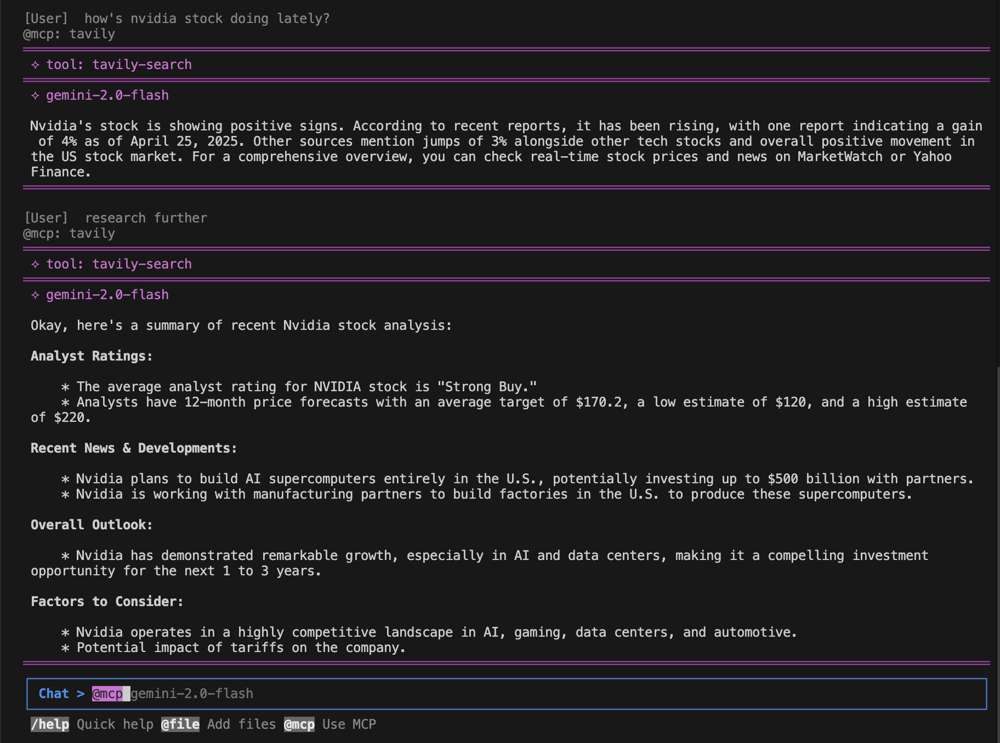
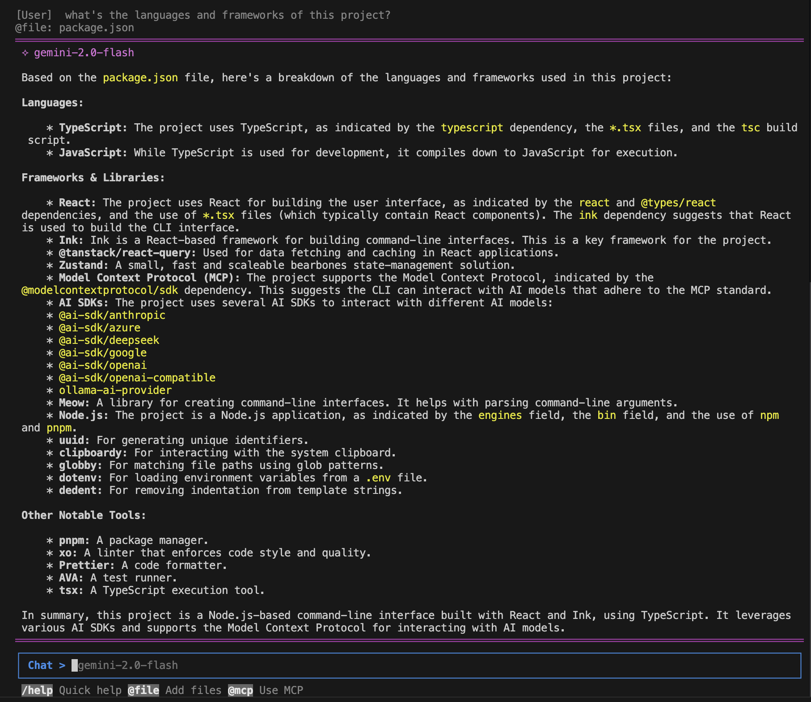
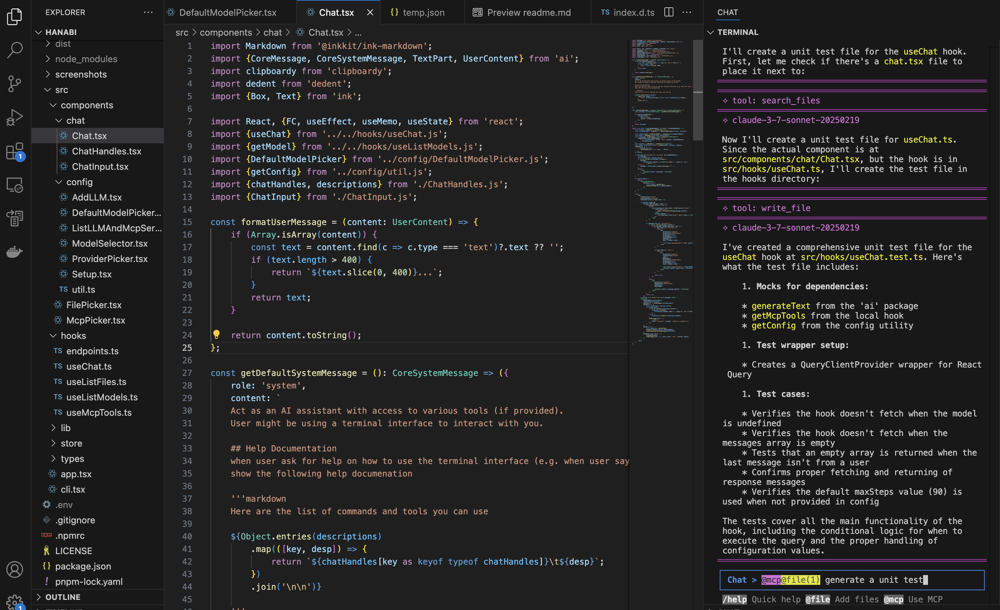

# hanabi-cli

> A command line AI chat interface to any LLM model, with files & MCP support. Use it as your claude/copilot alternative or any other use cases.







## Install

```bash
$ npm install -g hanabi-cli
```

## CLI

Get Help

```
$ hanabi --help
```

Start hanabi chat session

```
$ hanabi
```

Reset config file

```
$ hanabi reset
```

Ask single question and print result. (Yes Hanabi auto injects today's date and timezone for you as context)

```
$ hanabi ask -q "how's the weather tomorrow?"
```

## MCP Servers

In your `<user home folder>/.hanabi.json`, add `mcpServers` config.

```json
{
	"llms": [
		// ...
	],
	"defaultModel": {
		// ...
	},
	"mcpServers": {
		"home-ai": {
			"name": "Home AI",
			"transport": "stdio",
			"command": "node",
			"args": ["c:/folder/home-mcp.js"]
		},
		"context7": {
			"name": "context7",
			"transport": "stdio",
			"command": "npx",
			"args": ["-y", "@upstash/context7-mcp@latest"]
		},
		"browser-use": {
			"name": "Browser-use automation",
			"transport": "sse",
			"url": "http://172.17.0.1:3003/sse",
			"headers": {
				"authentication": "Bearer api-token"
			}
		},
        // might not work if you are using Windows or nvm, try: https://github.com/modelcontextprotocol/servers/issues/64
		"tavily": {
			"name": "Tavily Search",
			"transport": "stdio",
			"command": "npx",
			"env": {
				"TAVILY_API_KEY": "your-api-key"
			},
			"args": ["-y", "tavily-mcp@0.1.4"]
		},
		"file-system": {
			"name": "file system",
			"transport": "stdio",
			"command": "npx",
			"args": [
				"-y",
				"@modelcontextprotocol/server-filesystem",
				"."
			]
		},
		"my-calendar": {
			"name": "My Calendar",
			"transport": "streamable_http",
			"url": "http://172.17.0.1:3001/mcp",
			"headers": {
				"authentication": "Bearer my-auth-token"
			}
		}
	}
}
```

## Exclude files

To prevent files from being accessed, add [globby](https://github.com/sindresorhus/globby) patterns in the config

All files included in the .gitignore will also be auto excluded.

```json
// <user home folder>/.hanabi.json
{
	"exclude": [
        "certificates", 
        "screenshots/**/*", 
        "passwords/*", 
        "*.pid"
    ],
	"llms": [
		// ...
	],
	"defaultModel": {
		// ...
	}
}
```

## Custom System Prompt

Hanabi comes with predefined simple system prompt to show docs on terminal commands and provide date & timezone context. You can provide extra system prompt in the config.

```json
// <user home folder>/.hanabi.json
{
	"systemPrompt": "When generating unit tests, always use vitest.",
	"llms": [
		// ...
	],
	"defaultModel": {
		// ...
	},
    // ...
}
```

## Local config file override
You can copy `<user home folder>/.hanabi.json` to your working directly (e.g. project level) to override user level config. LLMs are merged by provider name.

## TODOs

- [x] include local files in chat
- [x] mcp support
- [x] add config to exclude custom files pattern
- [x] support for custom system prompts (via cli and config)
- [x] support working dir level `.hanabi.json` override, smililar to how .npmrc works
- [ ] add web server host mode (ie api and web interface)
- [ ] Flowise agent support
- [ ] Dify agent support
- [ ] n8n agent support ?
